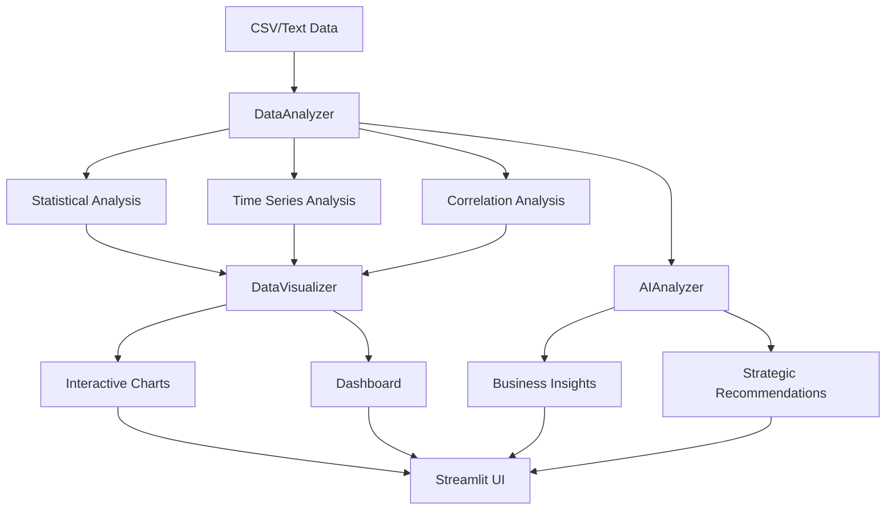

# 企業データ分析システム - 技術ドキュメント

## 📋 目次

1. [システムアーキテクチャ](#システムアーキテクチャ)
2. [モジュール詳細](#モジュール詳細)
3. [API リファレンス](#api-リファレンス)
4. [設定詳細](#設定詳細)
5. [開発ガイド](#開発ガイド)
6. [トラブルシューティング](#トラブルシューティング)

## 🏗️ システムアーキテクチャ

### モジュール構成

```
📦 企業データ分析システム/
├── 🚀 START_GUI.bat          # メイン起動ファイル
├── 📊 START_WEB.bat          # Web版起動ファイル
├── 📋 main.py                # メインエントリーポイント
├── 🔧 .env                   # 環境設定
├── 📁 src/                   # ソースコード
│   ├── 🎯 core/              # コアモジュール
│   │   ├── config.py         # 設定管理クラス
│   │   ├── data_analyzer.py  # データ分析エンジン
│   │   ├── visualizer.py     # 可視化エンジン
│   │   └── ai_analyzer.py    # AI分析エンジン
│   └── 🎨 ui/                # ユーザーインターフェース
│       └── streamlit_app.py  # Streamlit Webアプリ
├── 📁 launchers/             # 起動・管理ツール
├── 📁 data/                  # データファイル
├── 📁 tests/                 # テストスイート
└── 📁 legacy/                # 旧バージョンファイル
```

### データフロー



## 🔧 モジュール詳細

### Config クラス

システム全体の設定を管理する中央設定クラス。

```python
class Config:
    # OpenAI API設定
    OPENAI_API_KEY: str
    OPENAI_MODEL: str
    
    # 分析用モデル設定
    ANALYSIS_MODEL: str      # 詳細分析用
    STRATEGY_MODEL: str      # 戦略提案用
    PROCESSING_MODEL: str    # 軽量処理用
    
    # パフォーマンス設定
    MAX_TOKENS_ANALYSIS: int
    MAX_TOKENS_STRATEGY: int
    MAX_TOKENS_PROCESSING: int
    TEMPERATURE: float
    
    # 利用可能モデル
    AVAILABLE_MODELS: List[str]
```

#### 主要メソッド

- `get_model_config(model_type: str) -> Dict`: モデル設定を取得
- `set_model(model_type: str, model_name: str) -> bool`: モデルを動的設定
- `get_model_recommendations(use_case: str) -> List`: 用途別推奨モデル
- `validate_config() -> bool`: 設定の妥当性チェック

### DataAnalyzer クラス

データ分析の中核エンジン。統計分析、時系列分析、相関分析を実行。

```python
class DataAnalyzer:
    def __init__(self, df: pd.DataFrame, text_data: Optional[str] = None)
    
    # 基本分析
    def get_basic_stats(self) -> Dict[str, Any]
    def get_correlation_analysis(self) -> Dict[str, Any]
    def get_categorical_analysis(self) -> Dict[str, Any]
    
    # 高度分析
    def get_time_series_analysis(self) -> Dict[str, Any]
    def detect_outliers(self) -> Dict[str, Any]
    def get_summary_insights(self) -> Dict[str, Any]
```

### DataVisualizer クラス

インタラクティブな可視化を生成。Plotly、Matplotlib、Seabornを活用。

```python
class DataVisualizer:
    def __init__(self, df: pd.DataFrame)
    
    # 基本可視化
    def create_distribution_plots(self) -> List[Figure]
    def create_correlation_heatmap(self) -> Figure
    def create_categorical_plots(self) -> List[Figure]
    
    # 高度可視化
    def create_time_series_plots(self) -> List[Figure]
    def create_outlier_plots(self) -> List[Figure]
    def create_advanced_plots(self) -> List[Figure]
    def create_executive_dashboard(self) -> Figure
```

### AIAnalyzer クラス

OpenAI GPTモデルを使用したAI分析エンジン。

```python
class AIAnalyzer:
    def __init__(self, api_key: Optional[str] = None)
    
    # AI分析
    def analyze_data_insights(self, analysis_results: Dict) -> str
    def generate_business_strategy(self, insights: str, context: str) -> str
    def suggest_next_actions(self, strategy: str) -> str
    
    # ユーティリティ
    def get_model_info(self) -> Dict[str, str]
    def estimate_cost(self, text_length: int, model: str) -> float
```

## � API リファレンス

### 設定管理 API

#### モデル設定

```python
# 利用可能なモデル一覧を取得
models = Config.get_available_models()

# 用途別推奨モデルを取得
cost_effective = Config.get_model_recommendations('cost_effective')
high_quality = Config.get_model_recommendations('high_quality')
high_speed = Config.get_model_recommendations('high_speed')
balanced = Config.get_model_recommendations('balanced')

# モデルを動的に設定
Config.set_model('analysis', 'gpt-4o')
Config.set_model('strategy', 'gpt-4')
Config.set_model('processing', 'gpt-3.5-turbo')
```

#### 設定取得

```python
# モデル設定を取得
analysis_config = Config.get_model_config('analysis')
# 返り値: {'model': 'gpt-4', 'max_tokens': 2000, 'temperature': 0.7}

strategy_config = Config.get_model_config('strategy')
processing_config = Config.get_model_config('processing')
```

### データ分析 API

#### 基本分析

```python
# データアナライザーの初期化
analyzer = DataAnalyzer(df, text_data="市場調査データ")

# 基本統計の取得
stats = analyzer.get_basic_stats()
# 返り値: {'stats': DataFrame, 'column_info': Dict, 'missing_values': Dict}

# 相関分析
correlation = analyzer.get_correlation_analysis()
# 返り値: {'correlation_matrix': DataFrame, 'insights': List[str]}

# カテゴリカル分析
categorical = analyzer.get_categorical_analysis()
# 返り値: {'category_counts': Dict, 'insights': List[str]}
```

#### 高度分析

```python
# 時系列分析
time_series = analyzer.get_time_series_analysis()
# 返り値: {'trends': Dict, 'seasonality': Dict, 'forecasts': Dict}

# 外れ値検出
outliers = analyzer.detect_outliers()
# 返り値: {'outlier_summary': Dict, 'outlier_data': DataFrame}

# 総合洞察
insights = analyzer.get_summary_insights()
# 返り値: {'key_insights': List[str], 'recommendations': List[str]}
```

### 可視化 API

#### チャート生成

```python
# 可視化エンジンの初期化
visualizer = DataVisualizer(df)

# 分布図の生成
distribution_plots = visualizer.create_distribution_plots()
# 返り値: List[plotly.graph_objects.Figure]

# 相関ヒートマップ
heatmap = visualizer.create_correlation_heatmap()
# 返り値: plotly.graph_objects.Figure

# 時系列プロット
time_plots = visualizer.create_time_series_plots()
# 返り値: List[plotly.graph_objects.Figure]
```

#### ダッシュボード

```python
# エグゼクティブダッシュボード
dashboard = visualizer.create_executive_dashboard()
# 返り値: plotly.graph_objects.Figure (複数のサブプロットを含む)

# 高度プロット
advanced_plots = visualizer.create_advanced_plots()
# 返り値: List[plotly.graph_objects.Figure]
```

### AI分析 API

#### 洞察生成

```python
# AI分析エンジンの初期化
ai_analyzer = AIAnalyzer(api_key="your_api_key")

# データ洞察の生成
insights = ai_analyzer.analyze_data_insights(analysis_results)
# 返り値: str (詳細な分析レポート)

# ビジネス戦略の生成
strategy = ai_analyzer.generate_business_strategy(insights, context)
# 返り値: str (戦略提案レポート)

# 次のアクション提案
actions = ai_analyzer.suggest_next_actions(strategy)
# 返り値: str (具体的なアクション項目)
```

#### ユーティリティ

```python
# モデル情報の取得
model_info = ai_analyzer.get_model_info()
# 返り値: {'model': str, 'max_tokens': int, 'cost_per_token': float}

# コスト見積もり
cost = ai_analyzer.estimate_cost(text_length=5000, model='gpt-4')
# 返り値: float (推定コスト USD)
```

## ⚙️ 設定詳細

### 環境変数 (.env)

```properties
# OpenAI API設定
OPENAI_API_KEY=your_openai_api_key_here
OPENAI_MODEL=gpt-4

# 分析用モデル設定
ANALYSIS_MODEL=gpt-4
STRATEGY_MODEL=gpt-4
PROCESSING_MODEL=gpt-3.5-turbo

# API パラメータ
MAX_TOKENS_ANALYSIS=2000
MAX_TOKENS_STRATEGY=2500
MAX_TOKENS_PROCESSING=500
TEMPERATURE=0.7
```

### モデル推奨設定

| 用途 | 推奨モデル | 理由 |
|------|------------|------|
| **コスト重視** | gpt-3.5-turbo | 低コスト、高速処理 |
| **高品質** | gpt-4.1 | 最高品質の分析 |
| **高速処理** | gpt-4o-mini | 軽量、高速レスポンス |
| **バランス** | gpt-4o | 品質とコストのバランス |

### パフォーマンス設定

```python
# メモリ使用量の最適化
CHUNK_SIZE = 1000          # データチャンクサイズ
MAX_PLOT_POINTS = 10000    # プロット最大ポイント数
CACHE_SIZE = 100           # キャッシュサイズ

# 並列処理設定
MAX_WORKERS = 4            # 最大ワーカー数
TIMEOUT_SECONDS = 300      # タイムアウト時間
```

## 🧪 開発ガイド

### テスト実行

```bash
# 全テストの実行
python -m pytest tests/ -v

# 特定モジュールのテスト
python -m pytest tests/test_config.py -v
python -m pytest tests/test_data_analyzer.py -v
python -m pytest tests/test_visualizer.py -v

# カバレッジレポート
python -m pytest tests/ --cov=src --cov-report=html
```

### デバッグモード

```python
# ログレベルの設定
import logging
logging.basicConfig(level=logging.DEBUG)

# デバッグ情報の有効化
Config.DEBUG_MODE = True
```

### 新機能の追加

1. **新しい分析機能**: `src/core/data_analyzer.py` に追加
2. **新しい可視化**: `src/core/visualizer.py` に追加
3. **新しいAI機能**: `src/core/ai_analyzer.py` に追加
4. **UI改善**: `src/ui/streamlit_app.py` を修正

### コーディング規約

```python
# 型ヒントの使用
def analyze_data(df: pd.DataFrame) -> Dict[str, Any]:
    pass

# ドキュメンテーション
def create_plot(data: pd.DataFrame) -> go.Figure:
    """
    データからプロットを作成
    
    Args:
        data: 可視化対象のデータ
        
    Returns:
        Plotlyフィギュアオブジェクト
    """
    pass
```

## 🚨 トラブルシューティング

### 一般的な問題

#### API Key関連

```bash
# エラー: Invalid API Key
# 解決: .envファイルでAPI Keyを確認
echo $OPENAI_API_KEY

# API Key取得方法
# 1. https://platform.openai.com/ にアクセス
# 2. API Keys セクションで新しいキーを作成
# 3. .envファイルに設定
```

#### メモリ不足

```python
# 大量データの処理
# 解決: チャンクサイズを調整
Config.CHUNK_SIZE = 500  # デフォルト: 1000

# プロット点数の制限
Config.MAX_PLOT_POINTS = 5000  # デフォルト: 10000
```

#### パフォーマンス問題

```bash
# Streamlit起動が遅い
# 解決: キャッシュをクリア
streamlit cache clear

# メモリ使用量を確認
python -c "import psutil; print(f'Memory: {psutil.virtual_memory().percent}%')"
```

### エラーコード

| コード | 説明 | 解決方法 |
|--------|------|----------|
| `CONFIG_001` | API Key未設定 | .envファイルを確認 |
| `DATA_001` | データ読み込みエラー | ファイル形式を確認 |
| `VIZ_001` | 可視化エラー | データ型を確認 |
| `AI_001` | AI分析エラー | API制限を確認 |

### ログファイル

```bash
# ログの場所
logs/
├── app.log          # アプリケーションログ
├── error.log        # エラーログ
└── performance.log  # パフォーマンスログ

# ログレベル
DEBUG    # 詳細情報
INFO     # 一般情報
WARNING  # 警告
ERROR    # エラー
CRITICAL # 致命的エラー
```

## 📚 関連リンク

- [OpenAI API Documentation](https://platform.openai.com/docs)
- [Streamlit Documentation](https://docs.streamlit.io/)
- [Plotly Documentation](https://plotly.com/python/)
- [Pandas Documentation](https://pandas.pydata.org/docs/)

---

**開発者向け情報は以上です。ユーザー向けガイドは [README.md](../README.md) をご覧ください。**
├── 📁 docs/
│   └── USAGE_GUIDE.md      # 使用ガイド
└── 📁 config/
    ├── .env                # 環境変数
    └── requirements.txt    # 依存関係
```

## 🚀 機能概要

### 🔧 設定可能なモデル
環境変数で以下のOpenAIモデルを選択可能：
- **gpt-4o** - 最新の高性能モデル
- **gpt-4** - バランスの取れた高品質モデル  
- **gpt-3.5-turbo** - 高速・コスト効率モデル

### 📊 データ分析機能
- **構造分析**: データ品質、型、欠損値の詳細分析
- **統計分析**: 相関分析、分布分析、異常値検出
- **AI分析**: GPTを使用した高度なパターン認識
- **ビジネスインサイト**: 企業観点からの洞察抽出

### 📈 可視化機能
- **相関行列**: ヒートマップによる変数間関係の可視化
- **分布分析**: ヒストグラム + 密度曲線
- **散布図**: インタラクティブな関係性分析
- **カテゴリ分析**: 棒グラフによる分布表示
- **ダッシュボード**: 統合的な可視化パネル

### 💡 戦略提案機能
- **現状分析**: データドリブンな課題・機会特定
- **行動計画**: 優先度付きアクションプラン
- **成果予測**: KPIと数値目標の設定
- **リスク分析**: 実装時の懸念点と対策
- **ロードマップ**: 短期・中期・長期戦略

## ⚙️ 環境設定

### 1. 基本セットアップ
```bash
# リポジトリをクローン
git clone <repository-url>
cd business-data-analyzer

# 依存パッケージをインストール
pip install -r requirements.txt
```

### 2. 環境変数設定
`.env`ファイルを編集：
```bash
# OpenAI API設定
OPENAI_API_KEY=your_actual_api_key_here

# モデル選択 (推奨設定)
ANALYSIS_MODEL=gpt-4        # 詳細分析用
STRATEGY_MODEL=gpt-4        # 戦略提案用  
PROCESSING_MODEL=gpt-3.5-turbo  # 個別処理用

# パラメータ調整
MAX_TOKENS_ANALYSIS=2000
MAX_TOKENS_STRATEGY=2500
MAX_TOKENS_PROCESSING=500
TEMPERATURE=0.7
```

### 3. モデル選択ガイド

| モデル | 特徴 | 用途 | コスト |
|--------|------|------|--------|
| **gpt-4o** | 最新・最高性能 | 重要な分析・戦略 | 高 |
| **gpt-4** | バランス型 | 通常の分析 | 中 |
| **gpt-3.5-turbo** | 高速・効率的 | 大量処理・開発 | 低 |

## 🖥️ 使用方法

### コマンドライン版
```bash
# 基本起動
python main.py

# または便利なバッチファイル
run_system.bat
```

### Webアプリ版
```bash
streamlit run streamlit_app.py
```
ブラウザで `http://localhost:8501` にアクセス

## 📝 開発・カスタマイズ

### モジュール構成
```python
# 設定管理
from config import Config

# データ分析
from data_analyzer import DataAnalyzer

# 可視化
from visualizer import DataVisualizer

# AI分析
from ai_analyzer import AIAnalyzer

# メインシステム
from main import BusinessDataAnalyzer
```

### カスタムプロンプトの追加
```python
# カスタム分析プロンプト
custom_prompt = """
あなたの業界特有の分析観点:
- 業界KPIの評価
- 競合比較分析  
- 規制環境の考慮
"""

# 実行
result = analyzer.ai_analyze_data(custom_prompt=custom_prompt)
```

### 新しい可視化の追加
```python
# visualizer.py に新しいメソッドを追加
def create_custom_visualization(self, output_path='custom.html'):
    # カスタム可視化ロジック
    pass
```

## 🐛 Git管理

### 基本的なワークフロー
```bash
# 変更の確認
git status

# 変更をステージング
git add .

# コミット
git commit -m "機能追加: 新しい分析手法の実装"

# プッシュ
git push origin main
```

### ブランチ戦略
```bash
# 新機能開発
git checkout -b feature/new-analysis-method

# 修正作業
git checkout -b hotfix/model-configuration

# マージ
git checkout main
git merge feature/new-analysis-method
```

## 📊 サンプルデータ

### 企業データサンプル
`business_data.csv` には以下の指標が含まれます：
- **Company**: 企業名
- **Revenue**: 売上高
- **Employees**: 従業員数
- **Industry**: 業界
- **Profit**: 利益
- **Market_Share**: 市場シェア
- **Customer_Satisfaction**: 顧客満足度
- **Growth_Rate**: 成長率

### 使用例
```python
# システム初期化
analyzer = BusinessDataAnalyzer()

# データ読み込み
df = analyzer.read_csv('business_data.csv')

# 分析実行
structure = analyzer.analyze_data_structure()
ai_analysis = analyzer.ai_analyze_data()
visualizations = analyzer.create_visualizations('dashboard')
strategy = analyzer.generate_business_strategy()
```

## 🛠️ トラブルシューティング

### よくある問題と解決策

**1. モジュールインポートエラー**
```bash
# Python パスの確認
export PYTHONPATH="${PYTHONPATH}:$(pwd)"
```

**2. API Key エラー**
```bash
# .env ファイルの確認
cat .env | grep OPENAI_API_KEY
```

**3. メモリ不足**
```python
# データサイズを制限
df_sample = df.sample(n=1000)  # 1000件にサンプリング
```

**4. 可視化ファイルが開けない**
```python
# ブラウザで直接開く
import webbrowser
webbrowser.open('ai_recommended_charts.html')
```

## 📈 パフォーマンス最適化

### API使用量の最適化
```python
# 軽量モデルを使用
Config.PROCESSING_MODEL = 'gpt-3.5-turbo'

# トークン数を調整  
Config.MAX_TOKENS_ANALYSIS = 1000

# バッチ処理
results = []
for batch in data_batches:
    result = analyzer.process_batch(batch)
    results.extend(result)
```

### メモリ使用量の最適化
```python
# チャンク処理
for chunk in pd.read_csv('large_file.csv', chunksize=1000):
    process_chunk(chunk)
```

## 🔒 セキュリティ

### API Key管理
- `.env`ファイルをGitにコミットしない
- 本番環境では環境変数を使用
- 定期的なキーローテーション

### データプライバシー
- 機密データの匿名化
- ローカル処理の推奨
- ログファイルの適切な管理

## 🚀 今後の拡張計画

### v2.0 予定機能
- [ ] リアルタイムデータ連携
- [ ] 機械学習モデル統合
- [ ] 多言語対応
- [ ] クラウドデプロイ対応

### v3.0 予定機能  
- [ ] 業界別テンプレート
- [ ] 自動レポート生成
- [ ] API サーバー化
- [ ] チーム機能

## 📞 サポート

- **Issues**: [GitHub Issues](github-issues-url)
- **Discussions**: [GitHub Discussions](github-discussions-url)
- **Documentation**: [Wiki](wiki-url)

## 📄 ライセンス

MIT License - 詳細は [LICENSE](LICENSE) ファイルを参照

---

**企業のデータドリブンな意思決定を支援し、競争優位性の獲得に貢献するシステムです。**
